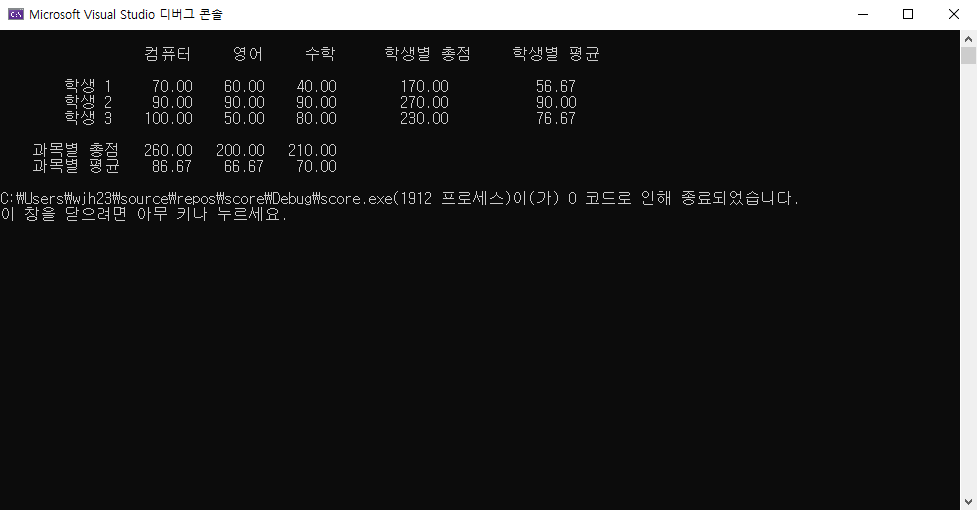

## 소스코드

	#include <stdio.h>
	struct stu
	{
		float com, eng, mat;
	};
	void dread(struct stu* p)
	{
		FILE* fp = fopen("dat.txt", "r");
		int i;
		for (i = 0; i < 3; ++i)
		{
			fscanf(fp,"%f %f %f", &p->com, &p->eng, &p->mat);
			++p;
		}
	}
	int main()
	{
		struct stu arr[3];
		int i;
		float subsum[3] = { 0, }, stusum[3];
		dread(arr);
		for (i = 0; i < 3; ++i)
		{
			subsum[0] += arr[i].com;
			subsum[1] += arr[i].eng;
			subsum[2] += arr[i].mat;
			stusum[i] = arr[i].com + arr[i].eng + arr[i].mat;
		}
		printf("\t\n\t\t  컴퓨터     영어     수학\t학생별 총점\t학생별 평균\n\n");
		for (i = 0; i < 3; ++i) printf("\t학생 %d\t%8.2f %8.2f %8.2f\t%8.2f\t%8.2f\n",i+1, arr[i].com, arr[i].eng, arr[i].mat, stusum[i], stusum[i] / 3);
		printf("\n    과목별 총점 ");
		for (i = 0; i < 3; ++i) printf("%8.2f ", subsum[i]);
		printf("\n    과목별 평균 ");
		for (i = 0; i < 3; ++i) printf("%8.2f ", subsum[i]/3);
		printf("\n");
		return 0;
	}

## 실행 결과

